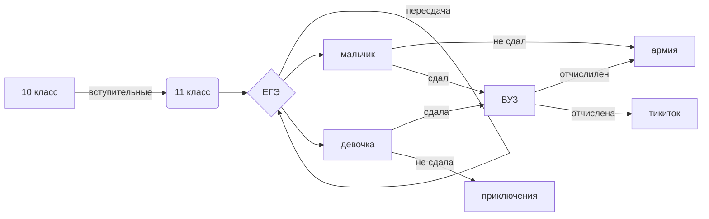

#  Левковский Александр 051


<!-- clock widget start -->
<script type="text/javascript"> var css_file=document.createElement("link"); css_file.setAttribute("rel","stylesheet"); css_file.setAttribute("type","text/css"); css_file.setAttribute("href","https://s.bookcdn.com//css/cl/bw-cl-sm2.css?v=0.0.1"); document.getElementsByTagName("head")[0].appendChild(css_file); </script> <div id="tw_25_73924705"><div style="width:200px; height:px; margin: 0 auto;"><a href="https://nochi.com/time/zheleznodorozhnyy-moscow-91309">Железнодорожный</a><br/></div></div> <script type="text/javascript"> function setWidgetData_73924705(data){ if(typeof(data) != 'undefined' && data.results.length > 0) { for(var i = 0; i < data.results.length; ++i) { var objMainBlock = ''; var params = data.results[i]; objMainBlock = document.getElementById('tw_'+params.widget_type+'_'+params.widget_id); if(objMainBlock !== null) objMainBlock.innerHTML = params.html_code; } } } var clock_timer_73924705 = -1; widgetSrc = "https://widgets.booked.net/time/info?ver=2;domid=589;type=25;id=73924705;scode=;city_id=91309;wlangid=20;mode=1;details=0;background=ffffff;border_color=ffffff;color=686868;add_background=ffffff;add_color=333333;head_color=ffffff;border=1;transparent=0"; var widgetUrl = location.href; widgetSrc += '&ref=' + widgetUrl; var wstrackId = ""; if (wstrackId) { widgetSrc += ';wstrackId=' + wstrackId + ';' } var timeBookedScript = document.createElement("script"); timeBookedScript.setAttribute("type", "text/javascript"); timeBookedScript.src = widgetSrc; document.body.appendChild(timeBookedScript); </script>
<!-- clock widget end -->


* Мои работы
- HaterYuumi.github.io
- бк.py - создание базы данных и работа с ней
- HaterYuumi.ipynb - код python которые я умею писать
- practice sql - работа sql с select и бд
- викторина - викторина на python
- certificate.pdf - сертификат урок цифры

# Шпоры ЕГЭ

$$ \bar E_1 ^{2}=\sqrt{\frac{Fa^{2-x}}{(x-1)*x}}+\alpha_{1}^{2}+\beta_{1}^{2} $$

$$ \ce{H_{2}O ->[4e-] 2H_{2} ^ +O_{2} ^} $$

$$d_{воз}= \frac{M_(вещ.)}{M_(воз.)}=21$$



```mermaid
gantt
    section Section
    Completed :done,    des1, 2014-01-06,2014-01-08
    Active        :active,  des2, 2014-01-07, 3d
    Parallel 1   :         des3, after des1, 1d
    Parallel 2   :         des4, after des1, 1d
    Parallel 3   :         des5, after des3, 1d
    Parallel 4   :         des6, after des4, 1d
 ```
